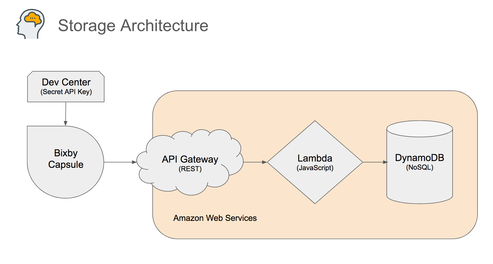

# Create a Bixby Capsule that uses AWS for Cloud Storage

## Overview

This is a tutorial repository, which you may freely clone or fork to create a new Bixby Capsule. It provides some
boilerplate code, and will show you how to create a Bixby capsule that uses Amazon Web Services for its cloud storage.

If you don't already have an AWS account, skip ahead to that step and [request one now](docs/01-request-aws-account.md).
It can take up to 3 days to be completely ready to use, and trying to use DynamoDB before then can lead to unexpected
errors.

When you are finished with tutorial, you'll have:
- an Amazon Web Services account of your own (Free Tier)
- an AWS DynamoDB that stores information for your Bixby capsule users
- an AWS Lambda function that handles database access and whatever back-end computation you need
- a secure REST api for accessing the above
- a working Bixby capsule that demonstrates how to store, recall, list and delete using the mechanisms above 

## Capsule Architecture

This architecture comes from experience creating "My Brain" capsule, which helps people remember bits of information,
by storing them in a database and recall them later with simple search questions.
Such a capsule requires cloud storage for each user's memories, to provide an individual experience
and a certain amount of privacy.

Communication between the capsule and the cloud requires a secret client api key (stored in the Bixby Developer Center)
to interact with a REST api over HTTPS. That REST api is the surface of a private AWS account that provides computing
power and storage that the capsule needs for remembering things and searching for them again later. The AWS account
contains a Lambda that provides computing resources in the form of a JavaScript program, and storage in the form of
a DynamoDB NoSQL database.

  

## Setting up Your Own Capsule

Start by cloning this repository, as it provides boilerplate code you'll need to create an AWS Lambda and
Bixby Capsule that work closely together. This tutorial contains simplified code from
[My Brain Lambda](https://github.com/vboughner/brain-lambda) and
[My Brain Capsule](https://github.com/vboughner/van.memory). It takes their basic functionality and combines
it here in a simplified form. When you finish this tutorial, you'll have a working Bixby capsule,
with storage in your own AWS account. From there you can modify it to create something new.

Follow the step-by-step instructions in each of the following documents:
- [Request an AWS Account](docs/01-request-aws-account.md)
- [Design and Plan](docs/02-design-and-plan.md)
- [Set up the Database](docs/03-database-setup.md)
- [Initialize the Lambda](docs/04-lambda-setup.md)
- [Configure the API Gateway](docs/05-api-gateway-setup.md)
- [Create and Publish the Capsule](docs/06-capsule-creation.md)
- [Maintain and Iterate](docs/07-maintenance-and-iteration.md)
