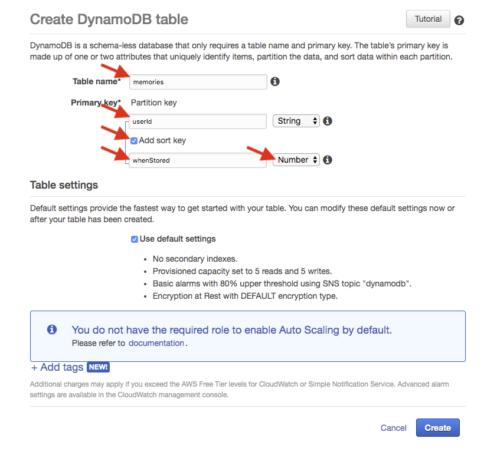

## Create your DynamoDB tables

You'll start by creating a table for storing "memories" for the example capsule. Take the following steps:
- log into the AWS Management Console and go to the [AWS DynamoDB Dashboard](https://console.aws.amazon.com/dynamodb)
- look for the `Create table` button and click on it
- you should see the Create DynamoDB table page (pictured below), you'll be entering something at each red arrow,
 please pay close attention because everything is case-sensitive
 (and these table and field names much match those stored as constants in the file `lambda/db.js`)
- enter `memories` for the Table name
- enter `userId` for the Primary Partition key
- check the `Add sort key` checkbox (which will reveal the sort key field)
- enter `whenStored` for the sort key
- choose `Number` as the type for the sort field
- leave the `Use default settings` checkbox alone (i.e. leave it checked),
- press the `Create` button, and you'll see a page that shows your table has been created

  

If you see an error at the last step, one that looks like "The AWS Access Key Id needs a subscription
for the service", your AWS account is probably not ready. If you haven't received that 3rd email from AWS
yet, the one that says everything is ready, you may just need to wait.

Sometimes, at this point, you might choose to use the user interface in the DynamoDB console to add initial data to
your table for testing purposes. If so, look for the "Items" tab for your table. The sample capsule we are creating
here does not require any initial data, the lambda code will add user ids and memories automatically,
as they are needed.

Next: [Create the Lambda](04-lambda-setup.md)
