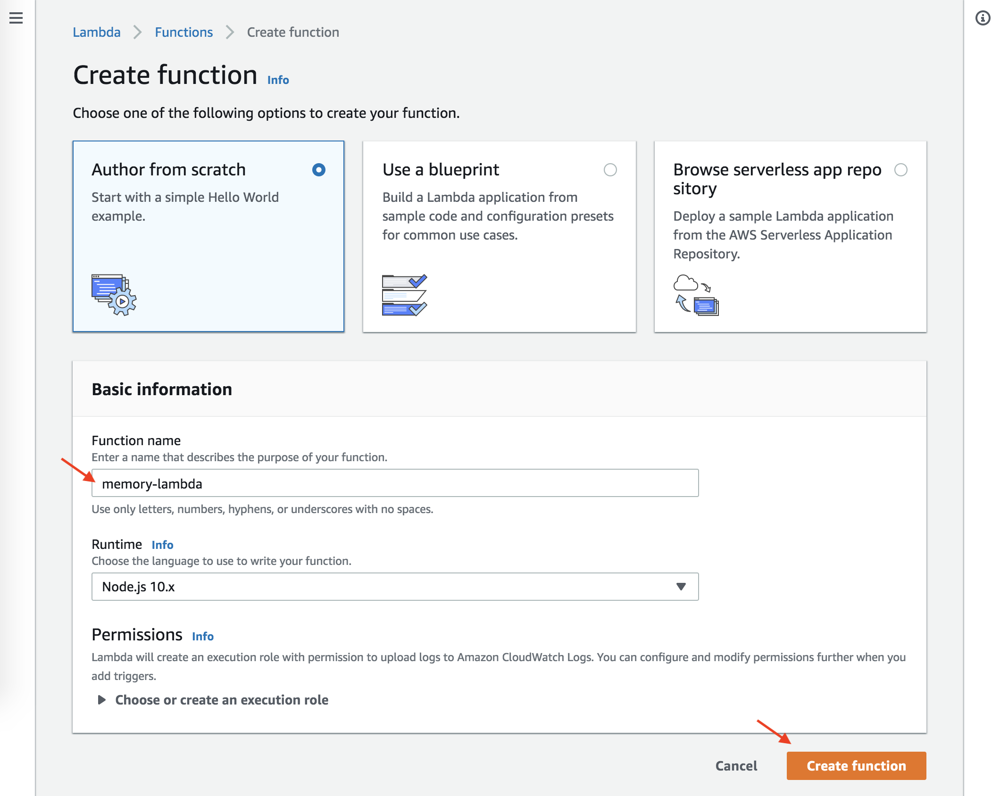
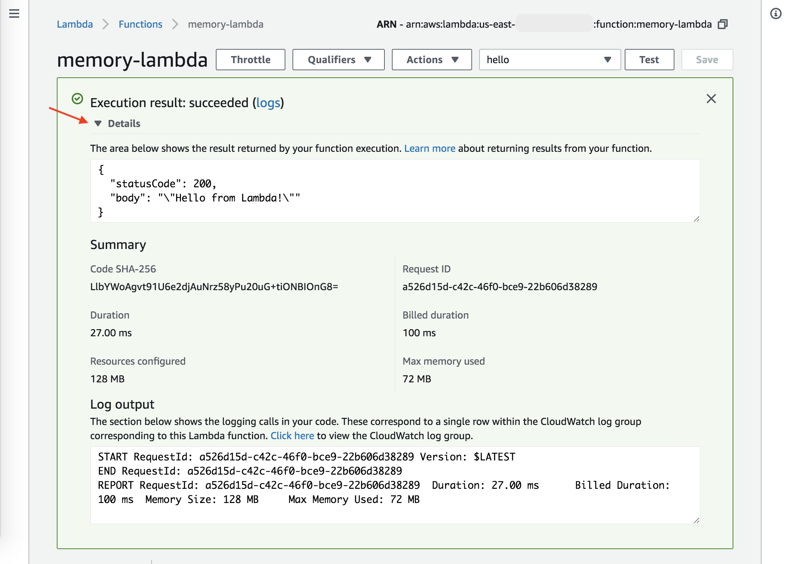
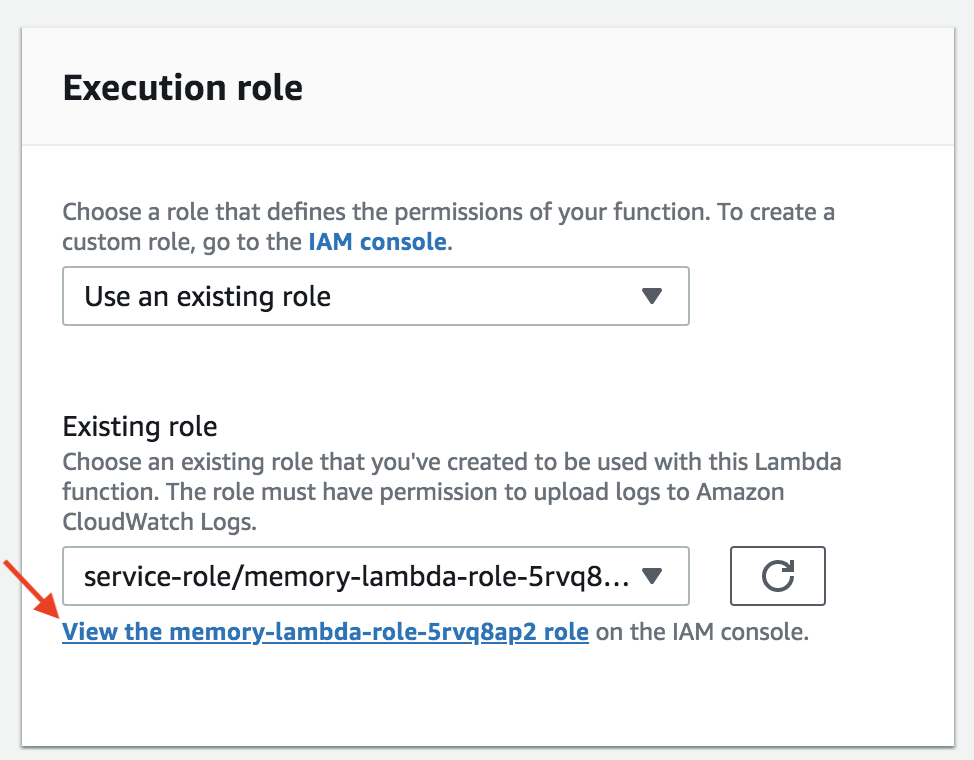
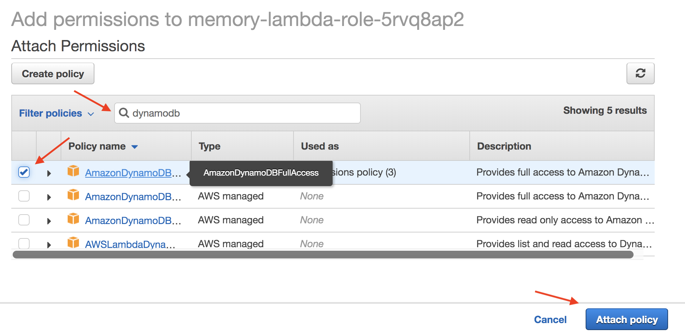
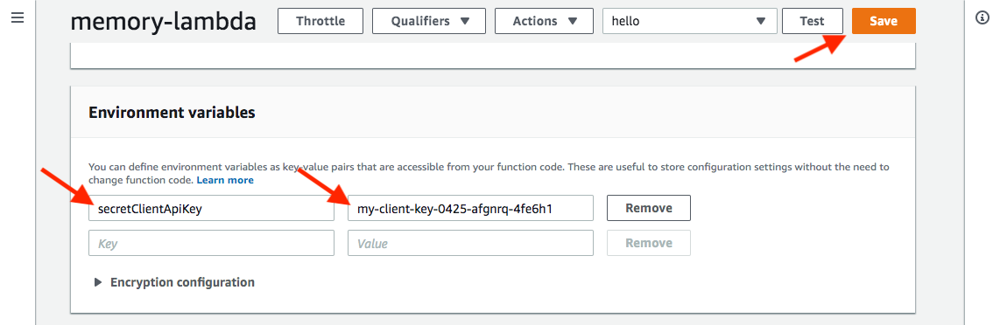
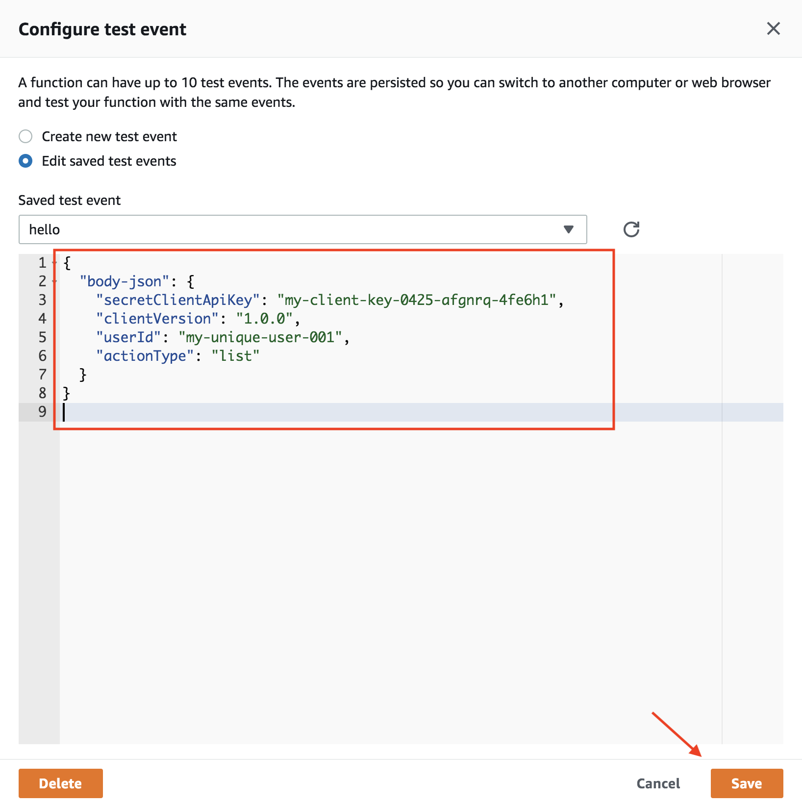
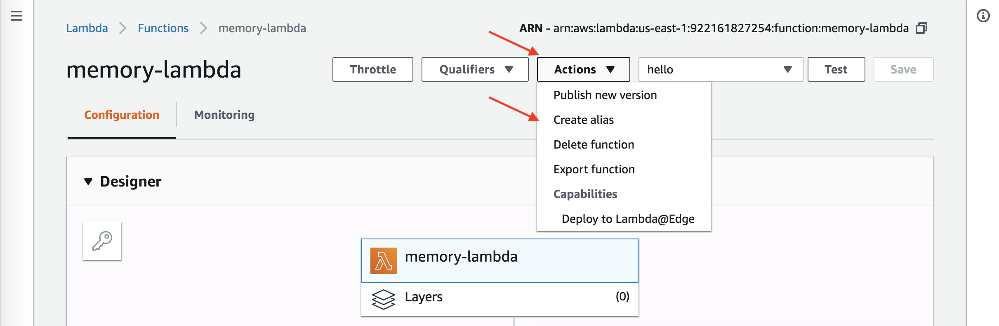
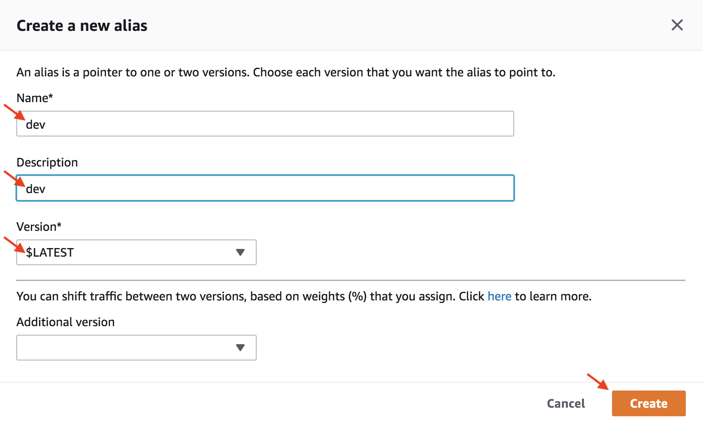
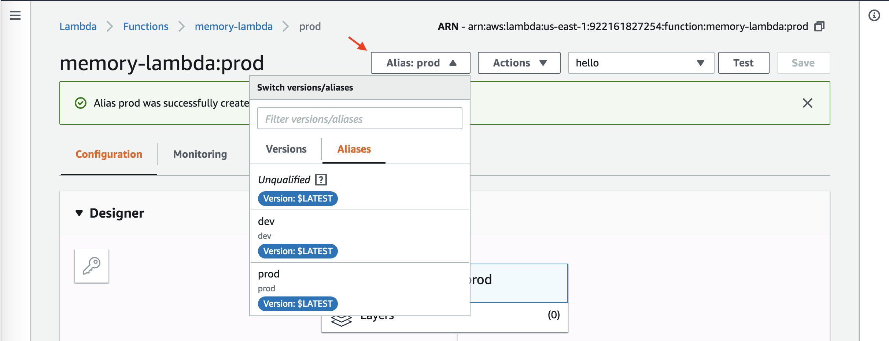

## Create the Lambda

The AWS Lambda is where your back-end code runs, follow these steps to set it up for the sample capsule:
- got to the [Lambda Dashboard](https://console.aws.amazon.com/lambda) in the AWS Management Console
- look for an orange button that says `Create function` and click on it
- enter the name of the function: `memory-lambda` (see image below, this name must match the lambda name in the `deploy.sh` script you use later)
- press the orange `Create` button

<p align="center">
  
</p>

Once the lambda is created, it has some Hello World code in it (and we'll replace this code in a later step).
Try out a test of the lambda by executing it:
- press the `Test` button near the top right
- choose any name for the new test event (I used `hello`)
- press the orange `Create` button at the bottom of the dialog window
- press the `Test` button near the top again, and this time it will run the lambda test
- click on the triangle next to `Details` to see the results (see image below)

<p align="center">
  
</p>

## Add Permission to access DynamoDB

Your lambda is going to need permission to access the DynamoDB table that you created. Follow these steps
to enable it to access every database table that you create:
- on the Lambda function page you've been using, scroll down to the `Execution Role` section
- click on the link called `View the memory-lambda role` (see image below) 

<p align="center">
  
</p>

- when the role is displayed, look for the blue `Attach policies` button and click on it
- when the policy list comes up, enter `dynamodb` into the search bar (see image below)
- check the box for `AmazonDynamoDBFullAccess` (you can see the different policy names by hovering over them) 
- press the `Attach policy` button

<p align="center">
  
</p>

## Set up Environment Variable

Your REST api is going to need a secret client api key to guarantee that no one else accesses
your lambda and database. Follow these steps to set this key into an environment variable for your Lambda:
- return to the lambda function page
- scroll down and look for the Environment Variable section (see image below)
- enter the name of the new environment variable: `secretClientApiKey` (case-sensitive)
- enter a unique key that is long enough to be difficult to guess, note it, because you'll need it again later when setting up the capsule (in this example I used `my-client-key-0425-afgnrq-4fe6h1`)
- press the orange `Save` button at the top of the lambda

<p align="center">
  
</p>

## Deploy New Lambda Code

This tutorial repository has everything you need to compile and deploy new code
to the AWS Lambda that you just created. Follow these steps to deply the sample capsule lambda code into the cloud:
- make sure you have npm and node installed already (here is [more information about this](https://docs.npmjs.com/downloading-and-installing-node-js-and-npm))
- make sure you already have the right `aws` credentials configured for your command line (see the [setup for cmdline tools](01-request-aws-account.md) on the AWS account setup page)
- open a terminal window on your local machine and change to the directory where you cloned this repository
- cd into the `lambda` sub-folder
- run this command: `npm install` and wait while the various npm packages are downloaded into the `node_modules` directory (about 17 packages, which will be deployed as part of the lambda)
- run this command: `npm run deploy` (it will take a minute or two, to zip and upload about 6-7 megabytes of JavaScript)
- if it succeeds, you'll see a JSON response in your terminal that contains information about your lambda function
- if it fails, double-check the name of the lambda in the script against the name of the lambda function in the AWS management console, they need to be the same and are case-sensitive

When you return to the Lambda management console on the AWS website, you'll see that the code is no longer displayed
there (because it is too large). The code there now is whatever was in the `lambda` folder of the repository, where
you just ran `npm run deploy`. You can update this code for this lambda again anytime, by running that script again.
Have a look at the `index.js` file in the `lambda` folder for the `exports.handler`, which is the entry point for
lambda code when it executes.

## Increasing Lambda Memory and Timeout

Sometimes you need a longer timeout, or more memory, so you can see certain kinds of error messages from the lambda code.
If you see a timeout error when your lambda runs, instead of a more informative error, try this:
- look for the `Basic settings` box on the Lambda function page
- set the timeout to something longer than 3 seconds (try 10 seconds for now)
- set the memory to something greater than 128M (try 256M for now)

## Test at the Lambda

You can test the newly deployed code on the lambda function web page, like this:
- press the `Test` button at the top of your lambda function page to run your Hello World test again (from earlier)
- it should run successfully, and the details will include a response that looks like this:
```javascript
{
  "success": false,
  "errorCode": 1001,
  "errorMessage": "missing body-json field"
}
``` 

The input event isn't yet formatted the way our `index.js` file expects to see it.
Let's make that test work better:
- look for a dropdown menu next to the `Test` button 
- pull down the menu and select `Configure test events`
- in the window that appears, change the JSON for the hello world test to the following (replacing what comes after `secretClientApiKey` with your own secret key if you made it different):
```javascript
{
  "body-json": {
    "secretClientApiKey": "my-client-key-0425-afgnrq-4fe6h1",
    "clientVersion": "1.0.0",
    "userId": "my-unique-user-001",
    "actionType": "list"
  }
}
```

<p align="center">
  
</p>

This time when you press `Test` again, you should see output like this:
```javascript
{
  "answers": [],
  "success": true,
  "speech": "There are no memories.",
  "serverVersion": "1.0.0"
}
```

Later, when we have the API Gateway working, we'll test like this again, using a tool called Postman.
And the REST api should work just like this, with a similar body in the POST request.

## Assigning Aliases for Development and Production

One day, after your capsule is released to the marketplace, your lambda will be used by devices in production and will
need a stable version. Let's create 2 release aliases for this lamba, one called `dev` and one called `prod`. For now,
they will both point to the latest version of your lambda function. Later you'll be able to use it to lock down
which version of your lambda is used in production (to keep things stable).

Here's how to set up the 2 aliases:
- choose the `Create alias` item from the `Actions` menu (see image below)
- in the window for creating an alias, enter `dev`, and `dev`, and choose the `LATEST` version
- create the `Create` button
- repeat the process again for, using `prod`, and `prod`, and `LATEST`
- when you are finished, you can view and choose which lambda version you are testing using the `Alias` dropdown

<p align="center">
  
</p>

<p align="center">
  
</p>

<p align="center">
  
</p>

Congratulations, your lambda is all set up!

Next: [Configure the API Gateway](05-api-gateway-setup.md)
