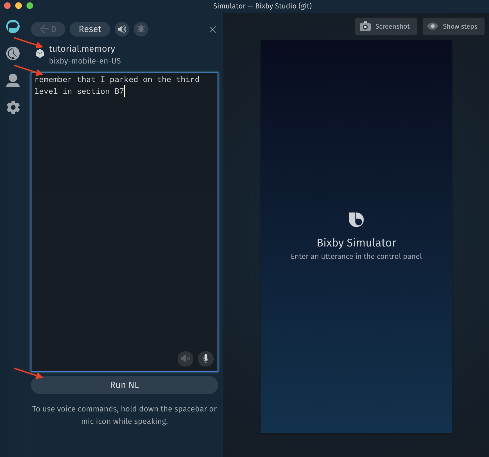
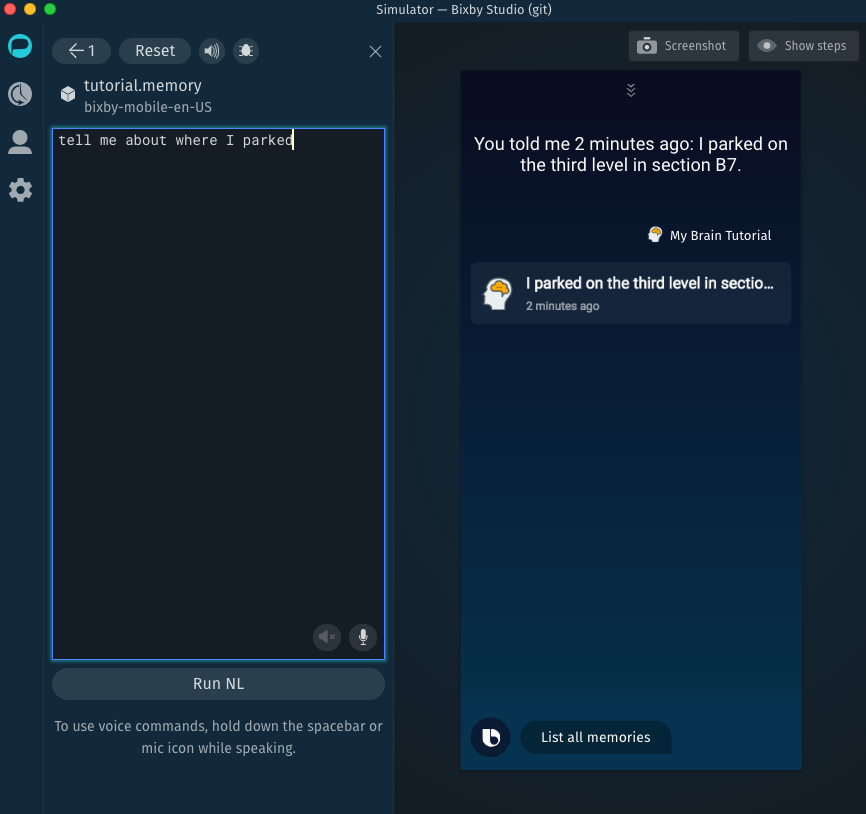

## Register Capsule in the Bixby Developer Center

- request a free Samsung account (if you don't already have one)
- log into the Bixby Developer Center
- click the `Teams & Capsules` link in the navigation sidebar
- create a new organization (if you don't already have one)
- register the "memory" sample capsule within this organization (see images below)

  

  

- click on the `Config & Secrets` tab for this capsule (configuration mode will be `dev`) (see image below)
- press the `+ Add` button under Configuration

  

- enter a `restApiUrl` key for `dev` (use the same URL as you tested with Postman) and press the `Add` button 

  

- press the `+ Add` button under Secrets
- enter a `secretClientApiKey` key for `dev`, and press the `Add` button

  

- press the `Save & Apply` button at the top to apply all new config and secret additions (you may need to click elsewhere in the window first, to get the top apply bar to show)

  

- select the `Prod` toggle for configuration mode
- enter a `restApiUrl` key for `prod` (remember to use `prod` instead `dev` in the url)
- press the `Add` button

  

- enter a `secretClientApiKey` key for `prod` (the same one you used for dev)
- press the `Add` button

  

- remember to `Save & Apply` the changes, when you are finished it should look like this:
 

  

## Create the Capsule

- download and install [Bixby Studio](https://bixbydevelopers.com/)
- run Bixby Studio and open a capsule using the `capsule` folder that is included in this tutorial repository
- update the `capsule.bxb` file there with your organization and capsule name (see image below)

  

## Test the Capsule

- open the Simulator window in Bixby Studio, using the phone icon on the left edge (near the bottom)
- press the `Compile` button if it is shown there (if this capsule does not already have a compiled Natural Language Model)

Now you may enter some NL into the Simulator window, try entering each of these statements
and press the `Run NL` button after each one:
- remember that I parked on the third level in section B7
- tell me about where I parked
- list all memories

  

  

## Iterate on Capsule Development

The tasks in this section continue your capsule development, by updating the sample code with
your own ideas. Some of the tasks you would do at this stage with your own capsule are:
- work out the REST api code that differs from the sample capsule
- create concepts and actions for your capsule's unique features
- update the training, to look for the correct responses to particular phrases
- complete the JavaScript code for new actions
- write new dialogs to determine how Bixby speaks when these actions run
- write new views to determine how it Bixby looks when these actions return results

## Submit a Release to Marketplace

When you capsule is ready to be submitted to the marketplace, here are some of the steps to take:
- create a private submission of the capsule
- test it on a device
- choose a marketplace category
- go through the checklist for submissions
- make a public submission when you are ready to release

Check the excellent documentation about
[how to prepare your capsule for submission](https://bixbydevelopers.com/dev/docs/dev-guide/developers/deploying.prep-marketplace).

Next: [Maintain and Iterate](07-maintenance-and-iteration.md)
